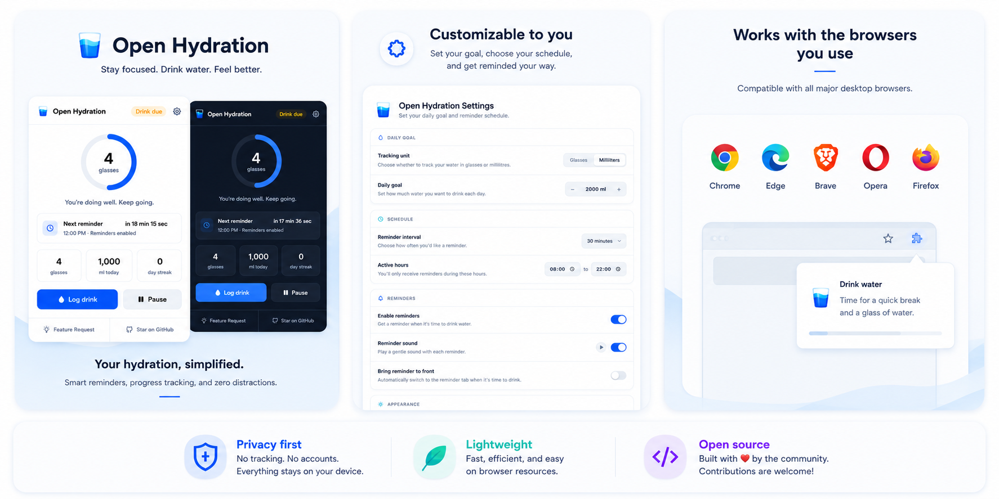

# Open Hydration

> Maintain your focus and stay hydrated.

Open Hydration is a free, open-source browser extension that helps you build a healthy hydration habit while you work. Whether you're writing code, designing, studying, or spending long hours at your computer, Open Hydration delivers gentle reminders that fit naturally into your workflow instead of interrupting it.

Built with privacy in mind, everything stays on your device. There are no accounts, no cloud sync, and no tracking. Just a simple, lightweight extension that helps you remember to drink water.



---

## ⭐ Features

### ◉ Gentle reminders that don't get in your way

Stay hydrated with reminders that work around your schedule instead of interrupting it. By default, reminders open quietly in the background, or you can choose to bring them to the front when it's time for a drink.

### ◉ A schedule that stays consistent

Reminder times stay aligned to the clock, so they never gradually drift throughout the day. If you choose a 30 minute interval, reminders always arrive on the hour and half hour.

### ◉ Built around your workday

Choose your active hours and Open Hydration only reminds you while you're working. No unexpected reminders after you've finished for the day.

### ◉ Track your daily progress

Log every drink in glasses or millilitres, set a daily hydration goal, and build a streak by reaching it consistently.

### ◉ Make it yours

Choose reminder intervals, sounds, themes, measurement units, and other preferences to match the way you work.

### ◉ Lightweight by design

Open Hydration focuses on one thing and does it well. It stays fast, uses minimal browser resources, and avoids unnecessary permissions or background activity.

---

## 🔒 Privacy first

Your hydration history belongs to you. Open Hydration is designed to respect your privacy from day one.

**◉ No tracking**\
No analytics, telemetry, advertising, or third-party trackers.

**◉ Local first**\
Your settings and hydration history are stored locally in your browser database.

**◉ No accounts**\
Install the extension and start using it immediately. No signup, login, or cloud sync required.

**◉ Minimal permissions**\
Open Hydration only requests the `alarms` permission to schedule reminders and the `notifications` permission to display notifications. It does not request host permissions, cannot access the websites you visit, and cannot read or modify their content.

---

## 🌐 Browser support

Open Hydration works with modern desktop browsers, including:

- Google Chrome
- Microsoft Edge
- Brave
- Opera
- Mozilla Firefox

---

## 🚀 Installation

### From the extension stores (Recommended)

Install Open Hydration directly from your browser's extension store.

- [Chrome Web Store](#)
- [Firefox Add-ons](#)

### Build from source

If you prefer to build the extension yourself:

```bash
# Clone the repository
git clone https://github.com/remotemerge/open-hydration.git

# Install dependencies
bun install

# Build for Chromium browsers
bun run build

# Load the generated extension from `.output/chrome-mv3` or `.output/firefox-mv3`.
```

---

## 🤝 Contributing

Contributions of all kinds are welcome. Whether you've found a bug, have an idea for an improvement, or want to contribute code, we'd love your help.

1. **Fork the repository** and clone your fork locally.

2. **Create a feature branch** for your changes.

3. **Make your changes** and follow the existing code style.

4. **Build and test** your changes, then commit and push your branch.

5. **Open a pull request** with a brief description of your changes.

Please keep **Open Hydration** focused on its core mission: helping people build a healthy hydration habit without unnecessary complexity.

---

## 📄 License

Open Hydration is released under the **MIT License**.

See the [LICENSE](LICENSE) file for details.